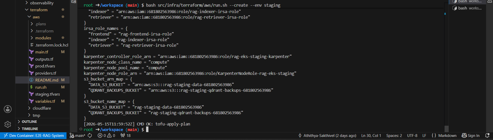
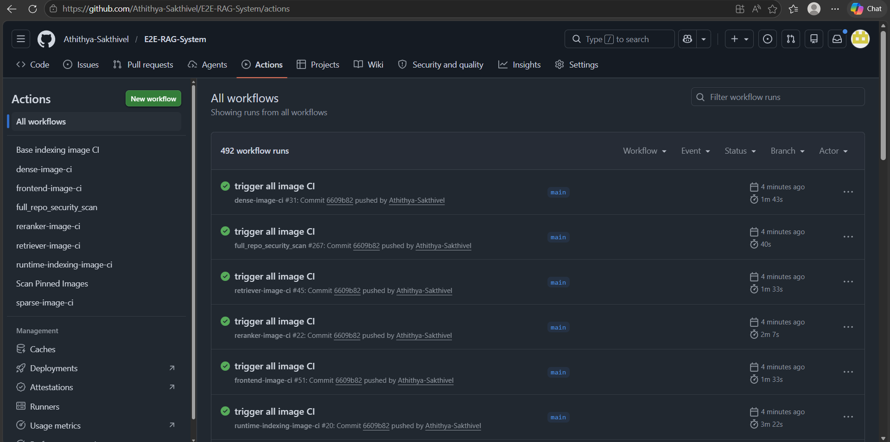
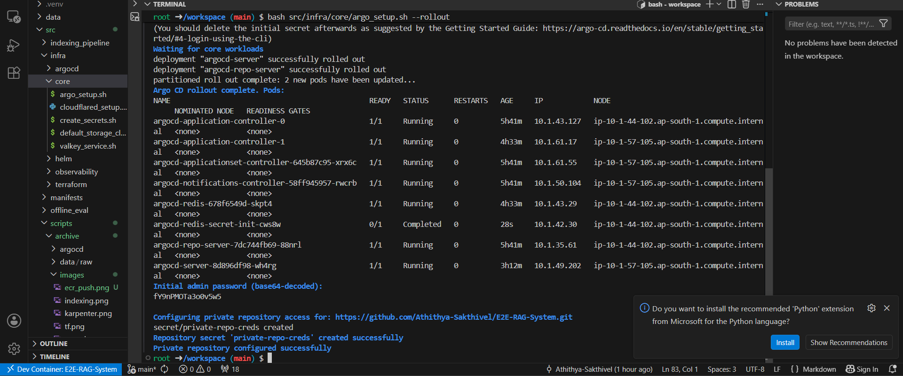
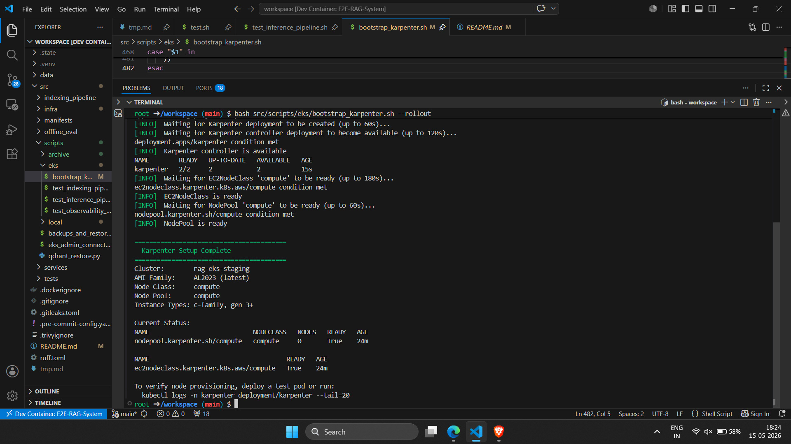
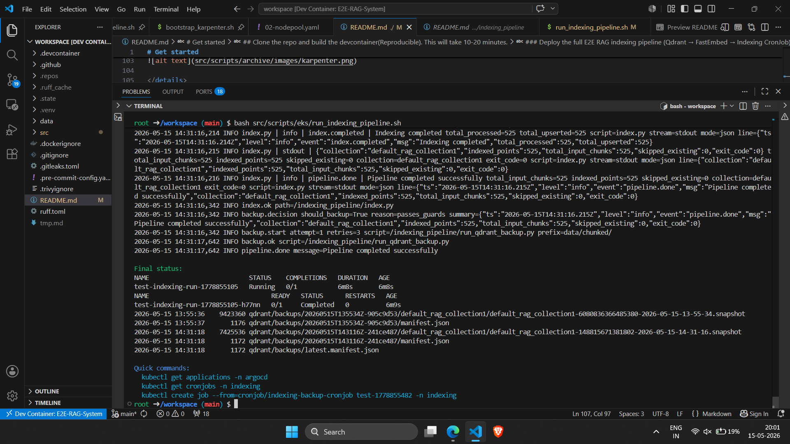
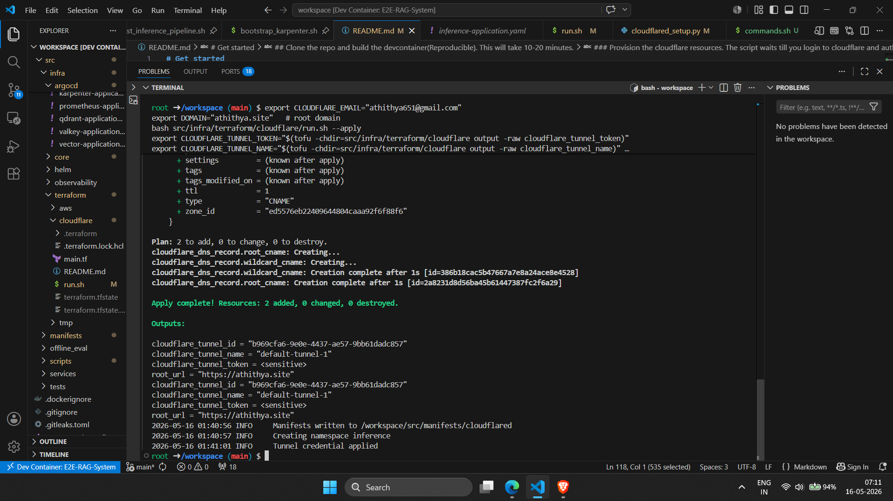
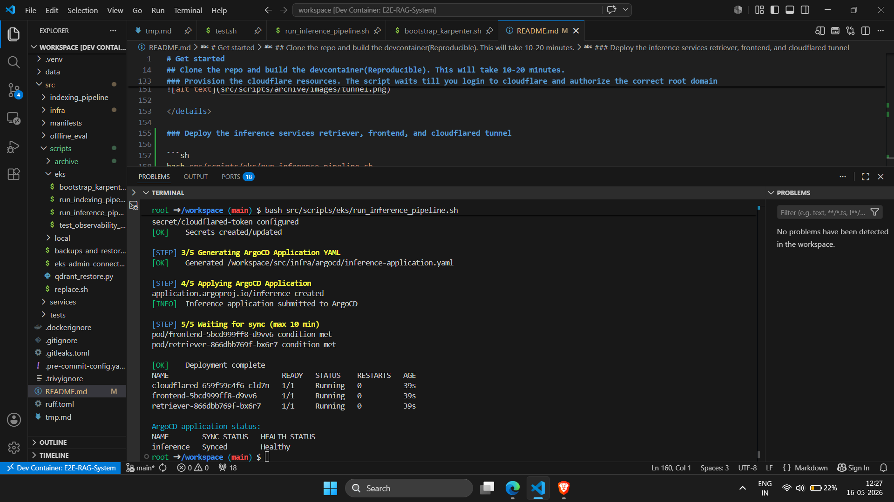
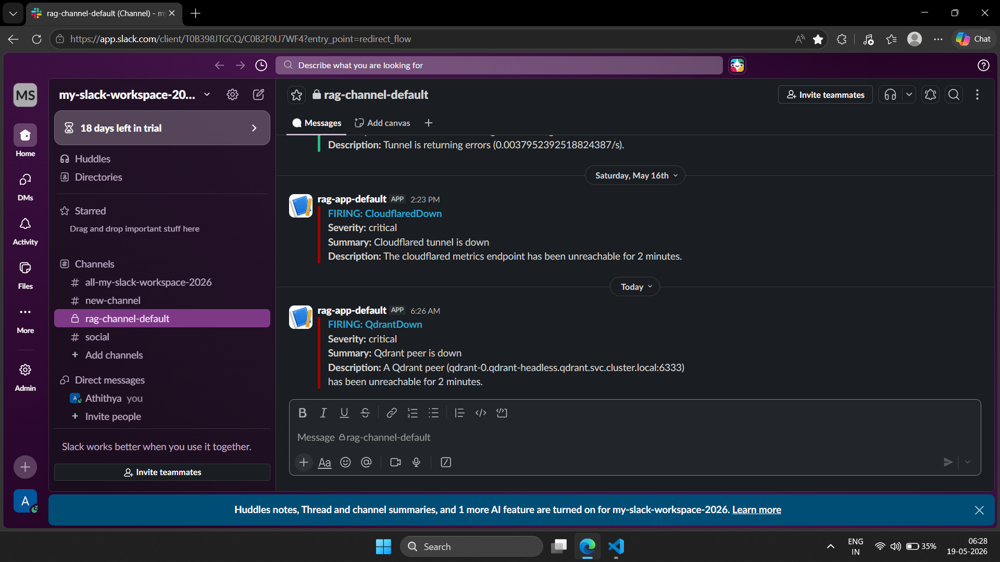

## [▶ RAG Demo Video](https://www.linkedin.com/posts/athithya-sakthivel-a23062341_rag-kubernetes-aws-ugcPost-7462146556369068032-HWum/?utm_source=share&utm_medium=member_desktop&rcm=ACoAAFWdiTsBt7H3ZH4nN3qLvJW2_oMz8yoTOPc)

---

**E2E-RAG-System** is a Kubernetes-native Retrieval-Augmented Generation (RAG) platform built on AWS.

Built on **Amazon EKS**, it implements the complete RAG lifecycle—from multi-format document ingestion, preprocessing, chunking, and indexing to hybrid retrieval, reranking, and streaming LLM inference. Every response is grounded in retrieved context, validated against supporting citations, and linked back to the original source documents through presigned S3 URLs.

---

### Architecture

The system separates the RAG lifecycle into two independent execution planes:

**Batch indexing plane**
An incremental, idempotent CronJob pipeline that ingests raw documents (PDF, DOCX, audio, images, CSV, Markdown, HTML, …) from S3, normalises and OCRs them, splits into traceable chunks, generates dense and sparse embeddings via stateless FastEmbed microservices, and upserts into **Qdrant** with full positional metadata. Backups are triggered automatically by configurable thresholds.

**Online inference plane**
A low‑latency streaming request path that authenticates users via OIDC, performs exact and semantic cache lookups, embeds the query (dense + sparse in parallel), executes hybrid Qdrant search with Reciprocal Rank Fusion, optionally re‑ranks with a cross‑encoder, builds a strictly‑grounded numbered prompt, and streams the answer via AWS Bedrock. Every response is citation‑validated—hallucinated references are stripped, and users can open original documents with one‑click presigned S3 URLs.

---


---

### Infrastructure

Infrastructure is declared with **OpenTofu (Terraform)**, workloads run on **EKS** with an on‑demand system nodegroup for platform services and **Karpenter** for elastically provisioning spot instances for stateless, bursty inference workloads. All state lives in **S3** and **ECR**. Container images are built deterministically and pushed via **GitHub Actions OIDC**—no long‑lived credentials.

---

### Microservices

| Service | Role | Key Details |
|---------|------|-------------|
| **Frontend** | OIDC gateway + chat UI | Serves the chat interface, handles Google/Microsoft sign-in, mints short-lived JWTs, proxies streaming requests |
| **Retriever** | RAG orchestration engine | Cache → embed → hybrid search → rerank → Bedrock → validate citations |
| **Dense Embedder** | Text → dense vectors | FastEmbed, 384‑dim L2‑normalized, stateless, lazy model loading |
| **Sparse Embedder** | Text → sparse vectors | SPLADE++ via FastEmbed, stateless |
| **Reranker** | Query × documents → scores | Cross‑encoder (MiniLM), auto‑triggered on low confidence |
| **Indexing CronJob** | Document ingestion pipeline | Pre‑conversion → chunking → embedding → Qdrant upsert → conditional backup |
| **Valkey** | Distributed rate limiting | Redis‑compatible, shared counters for SlowAPI, NetworkPolicy‑enforced isolation |
| **Cloudflared** | Secure tunnel termination | Routes hostnames to internal ClusterIP services, blocks observability endpoints at edge, Prometheus metrics |

---

### Connectivity & Auth

External access is provided through a single **Cloudflare Tunnel** (SSL strict, no public IPs or load balancers). Authentication uses **OAuth (Google, Microsoft)** with short‑lived JWTs and domain‑scoped allowlists. Rate limiting is per‑user (sub‑based, not IP), backed by **Valkey**.

---

### Observability

Built‑in, no external SaaS required:
- **Prometheus + Alertmanager** — 20+ alert rules, Slack notifications with inhibition
- **Grafana** — auto‑discovered dashboards via ConfigMap sidecar
- **Vector + ClickHouse** — structured JSON log aggregation with 30‑day retention

---

### Security

Layered across the full stack:
- **Edge:** Cloudflare Tunnel with SSL strict and endpoint filtering
- **Auth:** OIDC with PKCE and CSRF state protection, ES256 JWTs (15‑min TTL), per‑provider domain/org/tenant allowlists
- **Network:** Kubernetes NetworkPolicies isolating namespaces by function
- **IAM:** IRSA for least‑privilege AWS access, GitHub Actions OIDC with per‑repo roles
- **Runtime:** Read‑only root filesystems, non‑root containers, no privileged pods
- **CI/CD:** Pre‑commit Gitleaks hook + CI‑side scanning (Gitleaks, Trivy, OpenGrep) on every commit
- **GitOps:** Argo CD reconciles cluster state from Git, self‑heals drift, rollbacks via `git revert`

---

By combining hybrid retrieval, precise citation grounding, clean separation of batch and online concerns, declarative infrastructure, layered security, and comprehensive observability, E2E‑RAG‑System serves as a robust **foundation** for running RAG systems in real production environments.

---

## Offline Evaluation

Automated evaluation against a 75-record golden dataset, tracked in MLflow.
`cat src/offline_eval/offline_eval_artifacts/summary.json`

```json
{
  "meta": { "records": 75 },
  "performance": { "success_rate": 1.0 },
  "retrieval": {
    "recall_at_k": 0.72,
    "hit_rate_at_k": 0.72,
    "mrr": 0.5793
  },
  "generation": {
    "fact_coverage": 0.7769,
    "groundedness": 0.9459,
    "response_similarity": 0.2498
  },
  "citations": {
    "citation_integrity": 0.8933
  },
  "errors": { "rate": 0.0 }
}
```

| Dimension | Highlight |
|-----------|-----------|
| Retrieval | Recall@K 0.72, MRR 0.58 |
| Generation | Groundedness 0.95, Fact Coverage 0.78 |
| Citations | Integrity 0.89 (low hallucination) |
| Reliability | 100% success, 0% errors |

Each record defines query, expected chunk, reference answer, and expected facts. Evaluation measures retrieval accuracy, fact coverage, groundedness, and citation integrity across all records.

---

# Get started

## Prerequisites
1. Docker installed, running *without* sudo access
2. **Visual Studio Code with the Dev Containers extension installed (for a deterministic environments): [https://code.visualstudio.com/docs/devcontainers/containers](https://code.visualstudio.com/docs/devcontainers/containers)**
3. **An AWS account with sufficient IAM permissions (AdministratorAccess or equivalent) to manage**:
   * Amazon EKS (Elastic Kubernetes Service)
   * EC2, VPCs, Subnets, and Security Groups
   * Amazon S3
   * IAM Roles, Policies, and Instance Profiles
   **AWS Free Tier is sufficient for development and testing purposes.**
4. **A Cloudflare account with a registered domain, with permissions to manage DNS records and create Cloudflare Tunnels (cloudflared)**

## Clone the repo and build the devcontainer(Reproducible). This will take 10-20 minutes. 
```sh 
cd $HOME && rm -rf E2E-RAG-System && git clone https://github.com/Athithya-Sakthivel/E2E-RAG-System.git && cd E2E-RAG-System && code .
```
> ctrl + shift + P -> paste `Dev containers: Rebuild Container Without Cache` and enter

### Open a new terminal and login to your gh account
```sh
git config --global user.name "Your Name" && git config --global user.email you@example.com
gh auth login

? What account do you want to log into? GitHub.com
? What is your preferred protocol for Git operations? SSH
? Generate a new SSH key to add to your GitHub account? No
? How would you like to authenticate GitHub CLI? Login with a web browser

! First copy your one-time code: <code>
- Press Enter to open github.com in your browser... 
✓ Authentication complete. Press Enter to continue...
```

### Create a private repo in your gh account

```sh
export REPO_NAME="E2E-RAG-System" # or any name
git remote remove origin 2>/dev/null || true
gh repo create "$REPO_NAME" --private >/dev/null 2>&1
REMOTE_URL="https://github.com/$(gh api user | jq -r .login)/$REPO_NAME.git"
git remote add origin "$REMOTE_URL" 2>/dev/null || true
git branch -M main 2>/dev/null || true
git push -u origin main
git pull
git remote -v
echo "[INFO] A private repo '$REPO_NAME' created and pushed. Only visible from your account."
```
---

### Phase 1: Infrastructure Foundation

#### 1.1 Provision AWS Infrastructure
Creates the VPC, EKS cluster, S3 buckets, ECR repositories, and all IAM roles. Uses OpenTofu (Terraform-compatible).

```sh
export TF_VAR_region="ap-south-1"
export TF_VAR_github_repository="Athithya-Sakthivel/E2E-RAG-System" # replace with REPO_NAME

bash src/infra/terraform/aws/run.sh --create --env staging
```

---


---

#### 1.2 Connect to Your New EKS Cluster

```sh
aws eks update-kubeconfig --region ap-south-1 --name rag-eks-staging
```

---

### Phase 2: Container Images (CI/CD)

#### 2.1 Trigger Image Builds to ECR
Replaces placeholder account IDs and region in CI workflow files so GitHub Actions can push images to your ECR. After running, open your repo's Actions tab — all 6 service images will build and push in ~5 minutes.

```sh
bash src/scripts/replace.sh
```

---




---

### Phase 3: GitOps Controller & Auto-Scaling

#### 3.1 Install Argo CD
Deploys the GitOps controller that will sync all applications from this repo. Requires a GitHub personal access token for private repo access.

```sh
export GIT_PAT=ghp_   # https://github.com/settings/tokens/new
bash src/infra/core/argo_setup.sh --rollout
```




#### 3.2 Bootstrap Karpenter for Spot Instance Auto-Scaling
Karpenter dynamically provisions EC2 instances for bursty, stateless workloads (model services, indexing jobs). It replaces the standard Kubernetes Cluster Autoscaler with faster, cost-optimized node provisioning.

```sh
export GH_REPO="https://github.com/Athithya-Sakthivel/E2E-RAG-System.git"
export GH_BRANCH="main"
export AWS_REGION="ap-south-1"
bash src/scripts/eks/bootstrap_karpenter.sh --rollout
```

---




---

### Phase 4: Data Ingestion & Vector Storage

#### 4.1 Deploy the Indexing Pipeline
Spins up Qdrant (3-node vector database), FastEmbed services (dense, sparse, reranker), and the indexing CronJob. This is where documents get ingested, chunked, embedded, and indexed.

> ⚠️ **Note:** Karpenter may take 5–15 minutes to provision EC2 instances if the cheapest matching instance type is unavailable. It retries with other c-family types automatically. Pods will stay Pending until a compatible instance launches.

```sh
export HF_TOKEN=   # Hugging Face token for model downloads(optional)
bash src/scripts/eks/run_indexing_pipeline.sh
```

---




---

### Phase 5: External Access & DNS

#### 5.1 Set Up Cloudflare Tunnel and DNS
Creates DNS records and a Cloudflare Tunnel that securely routes traffic to your cluster — no LoadBalancers or public IPs needed. The script waits for you to authorize Cloudflare access.

```sh
export CLOUDFLARE_ACCOUNT_ID=
export CLOUDFLARE_GLOBAL_API_KEY=
export CLOUDFLARE_EMAIL="athithya651@gmail.com"
export DOMAIN="athithya.site"

bash src/infra/terraform/cloudflare/run.sh --apply

# Export tunnel credentials
export CLOUDFLARE_TUNNEL_TOKEN="$(tofu -chdir=src/infra/terraform/cloudflare output -raw cloudflare_tunnel_token)"
export CLOUDFLARE_TUNNEL_NAME="$(tofu -chdir=src/infra/terraform/cloudflare output -raw cloudflare_tunnel_name)"
export CLOUDFLARE_TUNNEL_ID="$(tofu -chdir=src/infra/terraform/cloudflare output -raw cloudflare_tunnel_id)"

# Deploy cloudflared with secrets
python3 src/infra/core/cloudflared_setup.py --write
```

---




---

### Phase 6: Query Engine & User-Facing Services

#### 6.1 Deploy the Inference Stack
Launches the retriever (RAG pipeline), frontend (chat UI + OIDC auth), Valkey (rate limiting), and cloudflared tunnel pod. You'll need OAuth credentials for at least one provider.

> 🔑 **OAuth Setup:** [Google](https://oauth2-proxy.github.io/oauth2-proxy/configuration/providers/google/#usage) | [Microsoft](https://oauth2-proxy.github.io/oauth2-proxy/configuration/providers/ms_entra_id)
```sh
export DOMAIN=athithya.site
export GOOGLE_CLIENT_ID=
export GOOGLE_CLIENT_SECRET=
export MS_CLIENT_ID=
export MS_CLIENT_SECRET=
export MICROSOFT_ALLOWED_TENANT_IDS=
export MICROSOFT_ALLOWED_DOMAINS=
bash src/scripts/eks/run_inference_pipeline.sh
```

---



---

### Phase 7: Observability

#### 7.1 Deploy Monitoring, Logging, and Alerting
Sets up Prometheus (metrics + alerts), Grafana (dashboards), ClickHouse (log storage), and Vector (log collector). Optionally connect Slack and PagerDuty for alerts.

```sh
export CLICKHOUSE_USER=vector
export CLICKHOUSE_PASSWORD=vectorpass
export SLACK_WEBHOOK_URL=   # Optional: Slack alerting
export PAGERDUTY_ROUTING_KEY=   # Optional: PagerDuty escalation
export ADMIN_PASSWORD=grafana
bash src/scripts/eks/observability_setup.sh
```

---

### Deployment Complete

Once deployment finishes, your environment should match the configuration demonstrated in the project video.

Open your browser and access the following services:

| URL                        | Service                                        |
| -------------------------- | ---------------------------------------------- |
| `https://rag.<DOMAIN>`     | RAG Chat UI (sign in with Google or Microsoft) |
| `https://argocd.<DOMAIN>`  | Argo CD (GitOps dashboard)                     |
| `https://grafana.<DOMAIN>` | Grafana (observability dashboards)             |

> **Note:** OIDC authentication is configured to allow all Google and Microsoft accounts by default. For production deployments, restrict access using the env vars `GOOGLE_ALLOWED_DOMAINS` and `MICROSOFT_ALLOWED_TENANT_IDS`.

---


### Optional: Test Alerting and Disaster Recovery

Simulate a complete Qdrant outage to verify Slack alerts fire and data can be restored from S3 backups.

```sh
# 1. Pause ArgoCD sync to prevent auto-healing during the test
kubectl patch application qdrant -n argocd --type='merge' \
  -p '{"spec": {"syncPolicy": null}}'

# 2. Delete Qdrant and its persistent volumes
kubectl delete pvc -n qdrant --all --ignore-not-found=true
kubectl delete namespace qdrant --ignore-not-found=true

# 3. Wait for the QdrantDown alert to trigger (~3 minutes)
echo "Waiting for QdrantDown alert..."
sleep 180

# 4. Re-enable ArgoCD — it recreates Qdrant with fresh volumes
kubectl patch application qdrant -n argocd --type='merge' \
  -p '{"spec": {"syncPolicy": {"automated": {"prune": true, "selfHeal": true}}}}'
echo "Waiting for ArgoCD to recreate Qdrant..."
sleep 180

# 5. Confirm Qdrant is back but empty
kubectl port-forward -n qdrant svc/qdrant 6333:6333 &>/dev/null & sleep 3
echo "Points before restore:"
curl -s http://localhost:6333/collections/default_rag_collection1 | jq '.result.points_count // 0'
kill %1 2>/dev/null || true

# 6. Restore from the latest S3 backup
export DATA_S3_BUCKET=$DATA_S3_BUCKET
export QDRANT_BACKUP_S3_PREFIX="qdrant/backups/"
bash src/scripts/backups_and_restore.sh restore

# 7. Verify data recovery
sleep 10
kubectl port-forward -n qdrant svc/qdrant 6333:6333 &>/dev/null & sleep 3
echo "Points after restore:"
curl -s http://localhost:6333/collections/default_rag_collection1 | jq '.result.points_count // 0'
kill %1 2>/dev/null || true
```

**What this validates:**
- Alertmanager fires `QdrantDown` and notifies Slack
- ArgoCD self-heals infrastructure when re-enabled
- S3 backups are restorable with point-count parity



## Cleanup

To tear down the entire infrastructure and avoid ongoing costs:

> **Note:** Karpenter manages AWS resources (EC2 instances, VPC tags) outside of Terraform state. If `terraform destroy` hangs, manually delete the VPC and verify no orphaned EC2 instances remain.

```sh
# 1. Remove workloads to trigger Karpenter scale-down
kubectl delete ns inference --ignore-not-found
kubectl delete ns fastembed --ignore-not-found
sleep 600   # Allow Karpenter to terminate spot instances

# 2. Destroy Cloudflare resources
bash src/infra/terraform/cloudflare/run.sh --destroy

# 3. Destroy AWS infrastructure
bash src/infra/terraform/aws/run.sh --destroy --env staging --yes-delete
```

**Post-cleanup verification:**
- Confirm no EC2 instances remain in the region (spot + on-demand)
- Verify the EKS cluster and associated security groups are removed
- Check that S3 buckets and ECR repositories are deleted (or emptied if retention was configured)
