# RAG8s — Enterprise RAG platform for internal knowledge bases

Ask questions of your own document corpus and get cited answers. Covers the end-to-end retrieval-augmented generation lifecycle — multi-format ingestion (PDF, DOCX, audio, images, CSV, Markdown, HTML), sentence-aware chunking, hybrid retrieval (dense + sparse with Reciprocal Rank Fusion), conditional cross-encoder reranking, streaming inference via AWS Bedrock, and citation-grounded generation — across 8 independently deployable microservices on Kubernetes (EKS).

**What makes this production-ready:**

- **Evaluated against a golden set** — offline evaluation over 75 curated records, tracked in MLflow. Latest run: groundedness **0.95**, citation integrity **0.89**, recall@3 **0.72** *(eval run at `top_k=3` to stay within Bedrock rate limits — smaller `top_k` keeps prompt tokens per query lower; production default is `top_k=5`)*.
- **Guardrailed output** — responses are citation-validated before streaming; hallucinated references are stripped, so users can open the original document at the cited page via one-click pre-signed S3 URLs.
- **Cost-aware inference** — exact and semantic response caching short-circuits the model call where possible; authenticated users are rate-limited to **5 reqs/min by default — keyed on the JWT subject, not IP — to cap LLM spend**.
- **Operable at org scale** — 2.6 s end-to-end latency, GitOps delivery with Argo CD, Karpenter Spot autoscaling for stateless workloads, 20+ Prometheus alerts, and structured 30-day log aggregation in ClickHouse.

Read [RAG Pipeline](#rag-pipeline-overview) for how retrieval actually works, [Offline Evaluation](#offline-evaluation) for the full methodology, or jump to the [Deployment Guide](#step-by-step-deployment-guide).

---

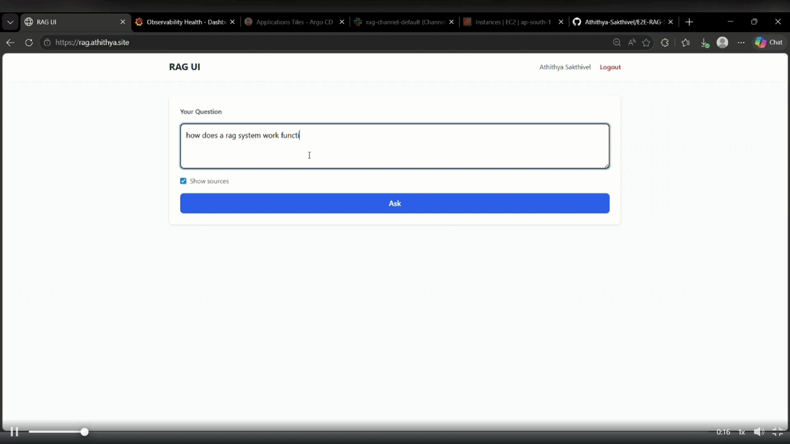

---

## Architecture

The RAG lifecycle is separated into two independent execution planes:

**Batch indexing plane.** An incremental, idempotent CronJob pipeline that ingests raw documents (PDF, DOCX, audio, images, CSV, Markdown, HTML, …) from S3, normalises and OCRs them, splits them into traceable chunks, generates dense and sparse embeddings via stateless FastEmbed microservices, and upserts them into **Qdrant** with full positional metadata. Backups are triggered automatically by configurable thresholds. [Batch Indexing Pipeline](src/indexing_pipeline/README.md)

**Online inference plane.** A low-latency streaming request path that authenticates users via OIDC, performs exact and semantic cache lookups, embeds the query (dense + sparse in parallel), executes hybrid Qdrant search with Reciprocal Rank Fusion, optionally re-ranks with a cross-encoder, builds a strictly grounded numbered prompt, and streams the answer via AWS Bedrock. Every response is citation-validated—hallucinated references are stripped, and users can open original documents with one-click presigned S3 URLs. [Inference Pipeline](src/services/inference_pipeline.md)


---


---

## RAG Pipeline Overview

The operational heart of the system. Everything else — Kubernetes, IAM, observability — exists to make this pipeline reliable, debuggable, and cheap to run.

> **Pipeline in one line:** exact cache → parallel dense+sparse embed → semantic cache → hybrid Qdrant with RRF → conditional cross-encoder rerank → numbered prompt → Bedrock with guardrails → structural citation validation → background cache write-back. Every external dependency has an independent circuit breaker and a fallback, so the failure mode is a worse answer, not an error.

### Ingestion & chunking

Chunking is **sentence-aware, token-bounded, and citation-traceable** — deliberately not fixed-character.

- **Sentence segmentation** via spaCy (`en_core_web_sm`), with blank-`en`/`sentencizer` and regex fallbacks. Each sentence carries `(text, start_char, end_char)` so chunk boundaries map back to exact source positions.
- **Token accounting** via tiktoken (`cl100k_base`) — the tokenizer family an LLM will actually see.
- **Packing** — sentences greedily packed to `MAX_TOKENS_PER_CHUNK` (default **512**), boundaries always on sentence edges.
- **Overlap** — `NUMBER_OF_OVERLAPPING_SENTENCES` (default **2**) preserves context across boundaries.
- **Floor** — chunks under `MIN_TOKENS_PER_CHUNK` (default **100**) merge into the previous chunk, so orphan headers never become standalone chunks.
- **Oversized sentences** split word-by-word, then at the token-ID level, so nothing is silently dropped.

Every chunk carries: `document_id` (SHA-256 of source — content-addressed), `chunk_id` (`{doc_id}_p{page}_{idx}` — deterministic), `page_number`, `source_url`, `parser_version` (enables re-index on parser upgrade), `semantic_region` (intro/early/middle/late/footer — a positional proxy for structure), and `figures` (OCR/caption/table text).

### Document Extraction (e.g., PDF)

PDFs get dedicated handling: PyMuPDF for layout and images, pdfplumber for tables. Text-block centers are x-clustered to detect and reflow multi-column layouts. Text overlapping a figure/table bbox by >25% is excluded from the prose stream; captions within 80pt below a figure attach to that figure. Images above 3 KB are OCR'd at 300 DPI via RapidOCR (ONNX), with Tesseract as fallback. `(cid:N)` font artifacts are stripped during cleaning.

### Why Embeddings Are Self-Hosted but the LLM Is Managed

**Embeddings are coupled to the index.** Changing the embedding model changes the vector space, requiring the corpus to be re-embedded and Qdrant to be rebuilt. This makes the embedder a long-lived, versioned component.
**The LLM is stateless.** Bedrock models can be changed without re-indexing because retrieval and prompt construction are provider-agnostic.

### Retrieval

A fixed, deterministic path — **a workflow, not an agent**:

1. **Exact cache** lookup by `cache_id = hash(query_norm, corpus_version, prompt_version, retrieval_version, model_name, tenant_id, top_k, fetch_k)`. Hit returns immediately.
2. **Query embedding** — dense and sparse in parallel via `asyncio.gather`, each behind its own circuit breaker. Failure of one degrades to single-vector mode.
3. **Semantic cache** — strict threshold (~0.84) first, then relaxed (~0.78). On a hit, the entry is promoted to the exact cache in the background.
4. **Hybrid search** — parallel Qdrant dense + sparse, fused via **Reciprocal Rank Fusion**.
5. **Conditional reranking** — cross-encoder fires only when fusion confidence is low or top-1/top-2 are close.
6. **Prompt construction** — top-`k` chunks numbered `[1]`, `[2]`, … in a grounded template.
7. **Generation** — Bedrock streams with AWS Guardrails enabled.
8. **Citation validation** — structural (see below).
9. **Cache write-back** — in a `BackgroundTask` so the SSE stream isn't held open.

**RRF** merges by rank, not score: `RRF(d) = Σ 1 / (k + rank_i(d))` with `k = 60`. Rank-based fusion avoids the scale mismatch between cosine similarity and learned-sparse scores, and needs no per-corpus weight tuning.

**Conditional reranking** fires on low fusion confidence or a narrow top-1/top-2 gap. Rerank and fusion scores are softmax-normalized and blended: `α · softmax(rerank) + (1 − α) · softmax(fusion)`. Non-pool candidates keep their relative order and append after the reranked pool. **Reranker failure falls back to fusion order — it never fails the request.**

Every response carries a `retrieval` metadata block (`mode`, `hybrid`, `dense_count`, `sparse_count`, `fused_count`, full `rerank_*` record) so the path is debuggable from the client side without reading server logs.

### Caching

- **Exact cache** — keyed by the composite hash above. Returns in microseconds. Invalidates automatically when any version component changes.
- **Semantic cache** — dense-vector lookup against a `__semantic_cache` collection. Strict threshold first, relaxed second. Semantic hits promote to the exact cache, so near-duplicates converge to free hits.
- **TTL + cleanup** — entries carry `CACHE_TTL_SECONDS`; a background loop purges expired entries.
- **Write-back** — happens in a `BackgroundTask` for streaming responses.

### Citation validation — structural, not entailment

Every `[N]` in the answer is checked against the passage indices actually inserted into the prompt. Invalid citations are **stripped**; if stripping empties the answer, `deterministic_summarize` fires. This catches the dominant failure mode — invented citation numbers — at zero added latency. It does **not** verify that a cited passage entails the sentence citing it.

---

## Cloud Infrastructure

Infrastructure is declared with **OpenTofu (Terraform)** and split across two providers. **AWS** hosts the compute and state: workloads run on **EKS** with an on-demand system nodegroup for platform services and **Karpenter** for elastically provisioning Spot instances for stateless, bursty inference workloads; all state lives in **S3** and **ECR**; container images are built deterministically and pushed via **GitHub Actions OIDC** — no long-lived credentials. **Cloudflare** sits at the edge: a single **Cloudflare Tunnel** terminates external traffic with SSL strict, provides DDoS mitigation, and exposes no public AWS IPs or load balancers.

---

## Microservices

| Service | Role | Key Details |
|---------|------|-------------|
| **Frontend** | OIDC gateway + chat UI | Serves the chat interface, handles Google/Microsoft sign-in, mints short-lived JWTs, proxies streaming requests |
| **Retriever** | RAG orchestration engine | Cache → embed → hybrid search → rerank → Bedrock → validate citations |
| **Dense Embedder** | Text → dense vectors | FastEmbed, `BAAI/bge-small-en-v1.5`, 384-dim L2-normalized, stateless |
| **Sparse Embedder** | Text → sparse vectors | FastEmbed, `Qdrant/minicoil-v1`, stateless |
| **Reranker** | Query × documents → scores | Cross-encoder (`Xenova/ms-marco-MiniLM-L-6-v2`), auto-triggered on low confidence |
| **Indexing CronJob** | Document ingestion pipeline | Pre-conversion → chunking → embedding → Qdrant upsert → [conditional backup](https://github.com/Athithya-Sakthivel/RAG8s/blob/main/src/indexing_pipeline/README.md#trigger-logic) |
| **Valkey** | Distributed rate limiting | Redis-compatible, shared counters for SlowAPI, NetworkPolicy-enforced isolation |
| **Cloudflared** | Secure tunnel termination | Routes hostnames to internal ClusterIP services, blocks observability endpoints at edge, Prometheus metrics |

---

## Connectivity & Auth

External access is provided through a single **Cloudflare Tunnel** (SSL strict, no public IPs or load balancers). Authentication uses **OAuth (Google, Microsoft)** with short-lived JWTs and domain-scoped allowlists.

**Two-tier rate limiting, with DDoS mitigation at the edge:**

- **Cloudflare edge** — DDoS mitigation at the tunnel boundary; no public origin IPs, so volumetric attacks never reach the cluster.
- **Per-user (JWT subject)** — default **5 reqs/min** at the frontend, to cap LLM spend per authenticated user.
- **Per-IP** — `60/min` on `/generate/stream`, `30/min` on `/presign` at the Retriever, against unauthenticated and scripted traffic.

Counters are shared across Retriever replicas via **Valkey**.

---

## Observability

Built-in, no external SaaS required:

- **Prometheus + Alertmanager** — 20+ alert rules, Slack notifications with inhibition rules
- **Grafana** — auto-discovered dashboards via ConfigMap sidecar
- **Vector + ClickHouse** — structured JSON log aggregation with 30-day retention

Logs are emitted as structured JSON with `service`, `environment`, `instance`, `namespace`, and a per-request `x-request-id` propagated end-to-end. Every stage emits Prometheus metrics (`qdrant_query_count`, `qdrant_query_duration`, `cache_lookup_count`, `cache_lookup_duration`, `cache_write_count`, `cache_write_duration`, `pipeline_duration`, `pipeline_errors`, `service_ready`), so a request can be reconstructed from logs + metrics without reproducing it.

---

## Security

Layered across the full stack:

- **Edge:** Cloudflare Tunnel with SSL strict and endpoint filtering
- **Auth:** OIDC with PKCE and CSRF state protection, ES256 JWTs (15-min TTL), per-provider domain/org/tenant allowlists
- **Network:** Kubernetes NetworkPolicies isolating namespaces by function
- **IAM:** IRSA for least-privilege AWS access, GitHub Actions OIDC with per-repo roles
- **Runtime:** Read-only root filesystems, non-root containers, no privileged pods
- **CI/CD:** Pre-commit Gitleaks hook + CI-side scanning (Gitleaks, Trivy, OpenGrep) on every commit
- **GitOps:** Argo CD reconciles cluster state from Git, self-heals drift, rollbacks via `git revert`

---

## Offline Evaluation

Automated evaluation against a 75-record golden dataset, tracked in MLflow.

```
cat src/offline_eval/offline_eval_artifacts/summary.json
```

```json
{
  "meta": { "records": 75, "top_k": 3 },
  "performance": { "success_rate": 1.0 },
  "retrieval": {
    "recall_at_3": 0.72,
    "mrr": 0.5793
  },
  "generation": {
    "fact_coverage": 0.7769,
    "groundedness": 0.9459,
    "response_similarity": 0.2498
  },
  "citations": {
    "citation_integrity": 0.8933
  },
  "errors": { "rate": 0.0 }
}
```

| Dimension | Highlight |
|-----------|-----------|
| Retrieval | Recall@3 0.72, MRR 0.58 |
| Generation | Groundedness 0.95, Fact Coverage 0.78 |
| Citations | Integrity 0.89 (low hallucination) |
| Reliability | 100% success, 0% errors |

### Golden set composition

Each record defines:

- `query` — a realistic employee question about the indexed corpus
- `expected_chunk_id` — the chunk that should be retrieved
- `reference_answer` — a hand-written ground-truth answer
- `expected_facts[]` — the atomic facts that must appear in a complete answer

75 records gives statistically meaningful signal on the four primary metrics, but is not enough to catch rare failure modes. A production expansion to 500+ records with adversarial cases is on the roadmap.

### Metric definitions

- **Recall@3** — fraction of queries where the expected chunk appears in the top-3 retrieved candidates.
- **MRR** — mean of `1 / rank` of the first relevant result.
- **Groundedness** — LLM-as-judge entailment score: fraction of claims in the generated answer that are supported by the retrieved passages.
- **Fact coverage** — fraction of `expected_facts` present in the answer. It is a recall-oriented metric: extra correct information is not penalized.
- **Citation integrity** — fraction of citation markers in the raw model output that reference a real retrieved passage, measured *before* stripping. This quantifies the raw hallucination rate; user-facing output has zero fake citations by construction.
- **Response similarity** — BLEU against the reference answer. Reported for transparency but **not optimized**: RAG answers are paraphrases, so a correct answer shares almost no lexical surface with an independently written reference. Optimizing BLEU would be optimizing the wrong objective.

### Eval caveats

- **Offline evaluation was run with `top_k=3`** to stay within Bedrock rate limits across the 75-record set. Production default is `top_k=5`, so recall is expected to be higher in operation. The next run will report both recall@3 and recall@5.
- **LLM-as-judge has biases.** It correlates well with human judgment but is not a substitute for it. A human-labeled subset for calibration is on the roadmap.
- **No online evaluation yet.** Feedback signals (thumbs, citation clicks) are not collected; offline metrics can drift from production behavior.

> By combining hybrid retrieval, precise citation grounding, clean separation of batch and online concerns, declarative infrastructure, layered security, and comprehensive observability, `RAG8s` serves as a **robust foundation** for running RAG systems in real production environments.

---

## Known Limitations

- **No per-document access filtering.** Authenticated users can query the full corpus. Query-time group-based filtering is required for enterprise access control.
- **No deletion reconciliation.** Deleting a source from S3 does not remove its Qdrant chunks. Soft tombstones with query-time filtering are planned.
- **Structural citation validation only.** Invalid citation IDs are detected, but citation entailment is not verified.
- **Single LLM provider.** Bedrock is currently the only generation provider.
- **No online evaluation.** Production feedback signals are not yet collected.
- **Retrieval recall depends on chunking and embeddings.** Recall@3 is currently 0.72; semantic chunking and a larger embedding model are the main improvement levers.

## If I Had One More Sprint

1. **Add query-time access filtering.** Enforce group-based Qdrant filters; use per-tenant collections where hard isolation is required.
2. **Add an LLM failover provider.** Route to a second provider when Bedrock is unavailable.

---

# Step-by-Step Deployment Guide

## Prerequisites

1. **Docker installed and running _without_ sudo access. Non-root is required for devcontainer stability. Run `sudo usermod -aG docker $USER && newgrp docker` if not already.**
2. **Visual Studio Code with the Dev Containers extension installed (for a deterministic environment): [devcontainers](https://code.visualstudio.com/docs/devcontainers/containers)**
3. **An AWS account with sufficient IAM permissions (AdministratorAccess or equivalent) to manage:**
   * Amazon EKS (Elastic Kubernetes Service)
   * EC2, VPCs, Subnets, and Security Groups
   * Amazon S3
   * IAM Roles, Policies, and Instance Profiles
   **AWS Free Tier is sufficient for development and testing purposes.**
4. **A Cloudflare account with a registered domain, with permissions to manage DNS records and create Cloudflare Tunnels (cloudflared).**

---

## Clone the repo and build the devcontainer (Reproducible).

```sh
cd $HOME && rm -rf RAG8s && git clone https://github.com/Athithya-Sakthivel/RAG8s.git
cd RAG8s && code .
```

> Ctrl + Shift + P → Paste `Dev containers: Rebuild Container Without Cache` and Enter. First-time build takes 5–15 minutes depending on network speed. You may create a GitHub codespace instead if network is slow.

---

### Open a new terminal and log in to your `gh` account as shown below

```sh
git config --global user.name "Your Name"
git config --global user.email you@example.com
gh auth login

? What account do you want to log into? GitHub.com
? What is your preferred protocol for Git operations? SSH
? Generate a new SSH key to add to your GitHub account? No
? How would you like to authenticate GitHub CLI? Login with a web browser

! First copy your one-time code: <code>
- Press Enter to open github.com in your browser...
✓ Authentication complete. Press Enter to continue...
```

---

## Create a new private repo in your GitHub account

```sh
export REPO_NAME="RAG8s" # or any name
git remote remove origin 2>/dev/null || true
gh repo create "$REPO_NAME" --private >/dev/null 2>&1
REMOTE_URL="https://github.com/$(gh api user | jq -r .login)/$REPO_NAME.git"
git remote add origin "$REMOTE_URL" 2>/dev/null || true
git branch -M main 2>/dev/null || true
git push -u origin main
git pull
git remote -v
echo "[INFO] A private repo '$REPO_NAME' created and pushed. Only visible from your account."
```

---

## Phase 1 — Infrastructure Foundation

### 1.1 Provision AWS Infrastructure

Creates the VPC, EKS cluster, S3 buckets, ECR repositories, and all IAM roles. Uses OpenTofu (Terraform-compatible).

```bash
export TF_VAR_region="ap-south-1"
export TF_VAR_github_repository=<user_name/<repo_name>"    # replace with your username and $REPO_NAME
bash src/infra/terraform/aws/run.sh --create --env staging
```

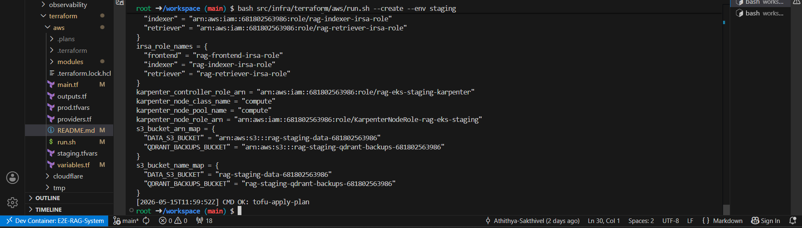

### 1.2 Connect to the New EKS Cluster

```sh
aws eks update-kubeconfig --region ap-south-1 --name rag-eks-staging
```

---

## Phase 2 — Container Images (CI/CD)

### 2.1 Trigger Image Builds to ECR

Replaces account IDs and region in CI workflow files so GitHub Actions can push images to your ECR. After running, open your repo's Actions tab — all 6 service images will build and push in ~5 minutes.

```sh
bash src/scripts/replace.sh
```

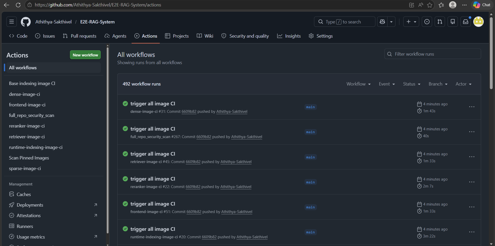

---

## Phase 3 — GitOps Controller & Auto-Scaling

### 3.1 Install Argo CD

Deploys the GitOps controller that will sync all applications from this repo. Requires a GitHub personal access token for private repo access. The secret shown is temporary.

```bash
export GIT_PAT=ghp_   # Visit https://github.com/settings/tokens/new
bash src/infra/core/argo_setup.sh --rollout
```

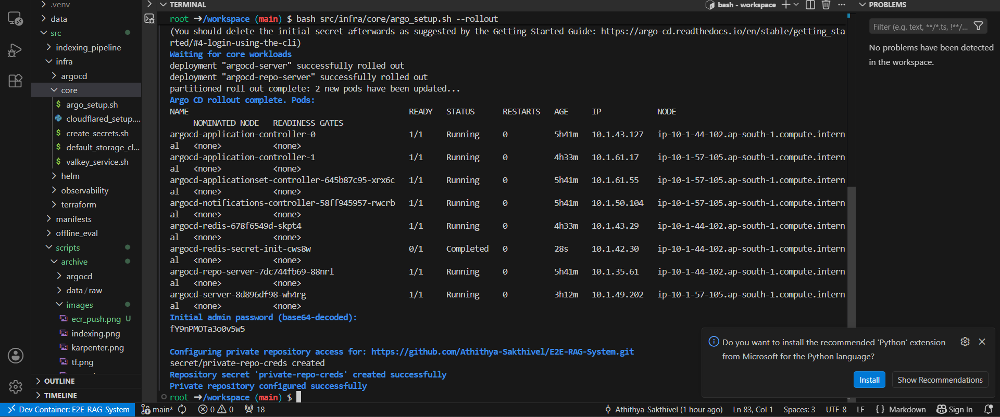

### 3.2 Bootstrap Karpenter for the stateless workloads

[Karpenter](https://karpenter.sh/docs/) automatically provisions EC2 Spot nodes labeled `node-type=compute:NoSchedule` for stateless workloads. The Frontend, Retriever, Embedders, Reranker, Indexing CronJob, and Cloudflared tunnel are scheduled onto these nodes using matching tolerations, while a Pod Disruption Budget keeps Cloudflared available. Underutilized nodes are automatically consolidated after 15 minutes (`WhenEmptyOrUnderutilized`).

```bash
export GH_REPO= # replace with your full repo url (https://github.com/<USER_NAME/$REPO_NAME.git)
export GH_BRANCH="main"
export AWS_REGION="ap-south-1"
bash src/scripts/eks/bootstrap_karpenter.sh --rollout
```

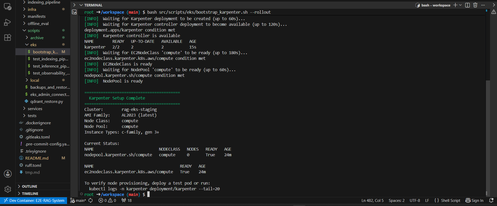

---

## Phase 4 — Data Ingestion & Vector Storage: Deploy the Indexing Pipeline

This phase sets up the complete document processing stack. It deploys Qdrant (a 3-node vector database for storing embeddings), FastEmbed services (three microservices for dense embeddings, sparse embeddings, and reranking), and finally the indexing CronJob that runs on a schedule.

Once deployed, this pipeline automatically handles the full document lifecycle: upload a few PDFs and HTMLs to S3, ingest raw files from S3, convert them to text (including OCR for pages/slides with images), split them into smaller chunks, generate embeddings for each chunk, and index them into Qdrant for fast retrieval.

See the [indexing pipeline documentation](src/indexing_pipeline/README.md) for configuration details.

```bash
export HF_TOKEN=   # Hugging Face token for faster model downloads (optional)
bash src/scripts/eks/run_indexing_pipeline.sh
```

> **NOTE:** Karpenter may take 5–15 minutes to provision EC2 instances if the cheapest matching instance type is unavailable. It retries with other c-family types automatically. Pods will stay Pending until a compatible instance launches.

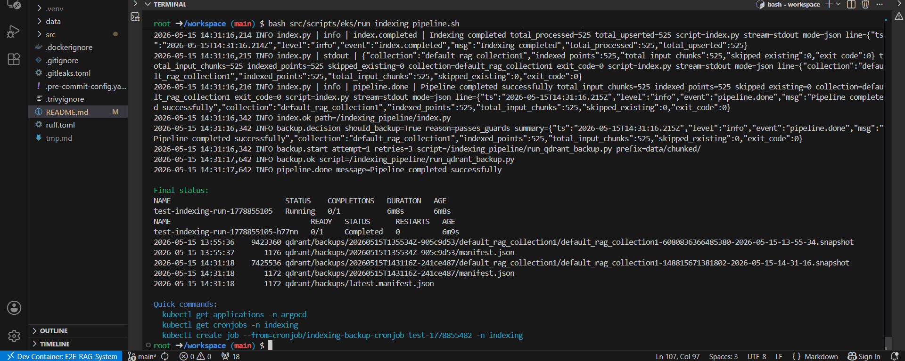

---

## Phase 5 — External Access & DNS: Set Up Cloudflare Tunnel and DNS

Creates DNS records and a [Cloudflared/Argo tunnel](https://developers.cloudflare.com/tunnel/) that securely routes traffic to your cluster — no LoadBalancers or public IPs needed. The script waits for you to authorize Cloudflare access.

```sh
export CLOUDFLARE_ACCOUNT_ID=      # Cloudflare dashboard > Account Home > Search and enter "Copy account ID".
export CLOUDFLARE_GLOBAL_API_KEY=  # https://dash.cloudflare.com/profile/api-tokens > API Keys
export CLOUDFLARE_EMAIL=           # example: "athithya651@gmail.com"
export DOMAIN=                     # example: "athithya.site"

bash src/infra/terraform/cloudflare/run.sh --apply

# Export tunnel credentials
export CLOUDFLARE_TUNNEL_TOKEN="$(tofu -chdir=src/infra/terraform/cloudflare output -raw cloudflare_tunnel_token)"
export CLOUDFLARE_TUNNEL_NAME="$(tofu -chdir=src/infra/terraform/cloudflare output -raw cloudflare_tunnel_name)"
export CLOUDFLARE_TUNNEL_ID="$(tofu -chdir=src/infra/terraform/cloudflare output -raw cloudflare_tunnel_id)"

# Deploy cloudflared with secrets
python3 src/infra/core/cloudflared_setup.py --write
```

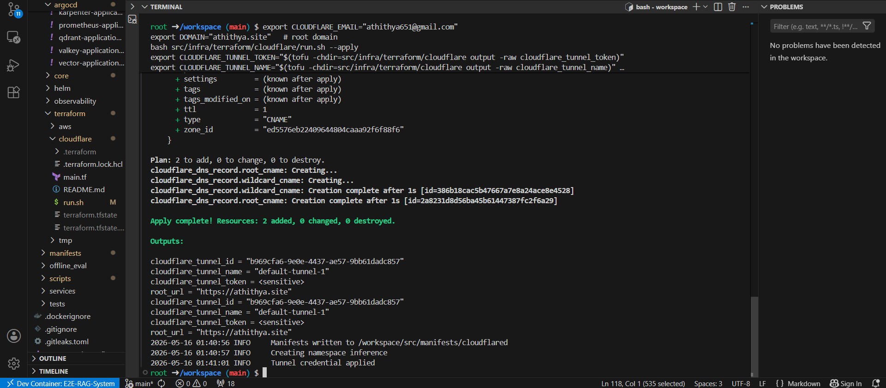

---

## Phase 6 — Query Engine & User-Facing Services: Deploy the Inference Stack

Launches the [retriever](src/services/retriever/README.md), [Chat UI + OIDC authentication](src/services/frontend), Valkey (for per-user rate limiting), and the [Cloudflared tunnel](https://developers.cloudflare.com/tunnel/). Configure OAuth credentials for Google, Microsoft, or both — enabling *either provider is sufficient* for user authentication.

> **Create OAuth Credentials** [Google](https://oauth2-proxy.github.io/oauth2-proxy/configuration/providers/google/#usage) | [Microsoft](https://oauth2-proxy.github.io/oauth2-proxy/configuration/providers/ms_entra_id)

```sh
export DOMAIN=                 # Use the same $DOMAIN
export GOOGLE_CLIENT_ID=             # Google OAuth client ID
export GOOGLE_CLIENT_SECRET=          # Google OAuth client secret
export GOOGLE_ALLOWED_DOMAINS="company.com,gmail.com"        # Comma-separated allowed email domains
export MS_CLIENT_ID=                       # Azure AD application (client) ID
export MS_CLIENT_SECRET=                   # Azure AD client secret
export MICROSOFT_ALLOWED_TENANT_IDS=       # Primary tenant ID (single-tenant or common)
export MICROSOFT_ALLOWED_DOMAINS="outlook.com,company.com"   # Comma-separated allowed email domains

bash src/scripts/eks/run_inference_pipeline.sh
```

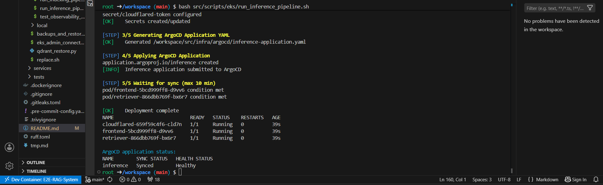

---

## Phase 7 — Observability

### 7.1 Deploy Monitoring, Logging, and Alerting

Sets up Prometheus (metrics + alerts), Grafana (dashboards), ClickHouse (log storage), and Vector (log collector). Optionally connect Slack and PagerDuty for alerts.

```sh
export CLICKHOUSE_USER=vector
export CLICKHOUSE_PASSWORD=vectorpass
export SLACK_WEBHOOK_URL=   # Optional: Slack alerting
export PAGERDUTY_ROUTING_KEY=   # Optional: PagerDuty escalation
export ADMIN_PASSWORD=grafana # set strong password
bash src/scripts/eks/observability_setup.sh
```

---

## End-to-End System Complete

### [▶ RAG8s Full Demo](https://www.linkedin.com/posts/athithya-sakthivel-a23062341_rag-kubernetes-aws-ugcPost-7462146556369068032-HWum/?utm_source=share&utm_medium=member_desktop&rcm=ACoAAFWdiTsBt7H3ZH4nN3qLvJW2_oMz8yoTOPc)

The deployment reproduces the **ground-truth configuration** shown in the project demo, including semantic caching, OAuth-authenticated per-user rate limiting, hybrid retrieval, and the complete RAG inference pipeline.

| URL | Service |
|------|---------|
| `https://rag.<DOMAIN>` | RAG Chat UI (Google/Microsoft sign-in) |
| `https://argocd.<DOMAIN>` | Argo CD (GitOps dashboard) |
| `https://grafana.<DOMAIN>` | Grafana (observability dashboards) |

> **Note:** OIDC allows all Google and Microsoft accounts by default. For production, restrict access with `GOOGLE_ALLOWED_DOMAINS` and `MICROSOFT_ALLOWED_TENANT_IDS`.

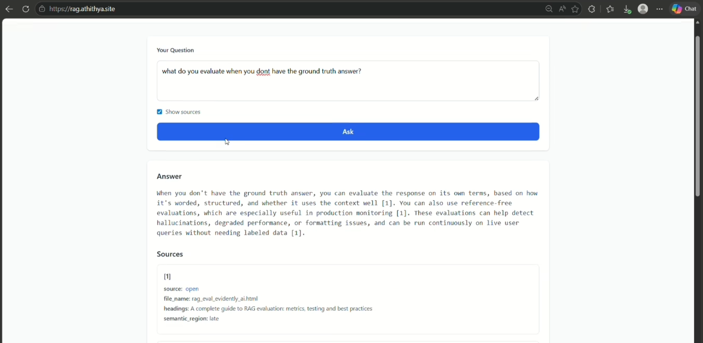

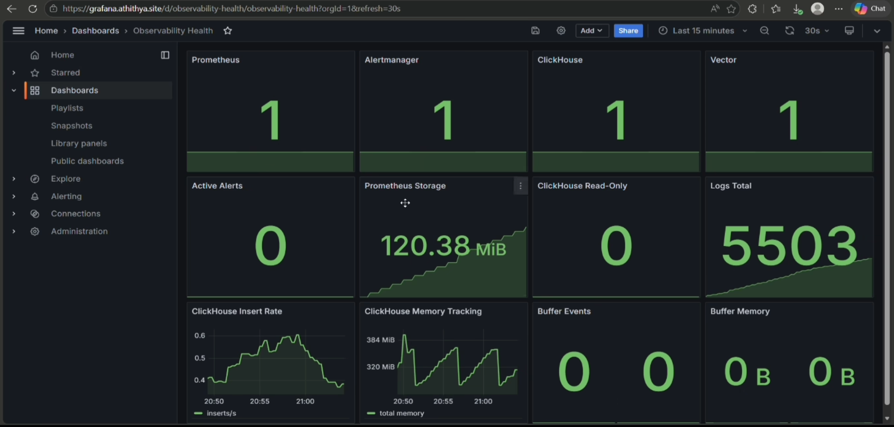

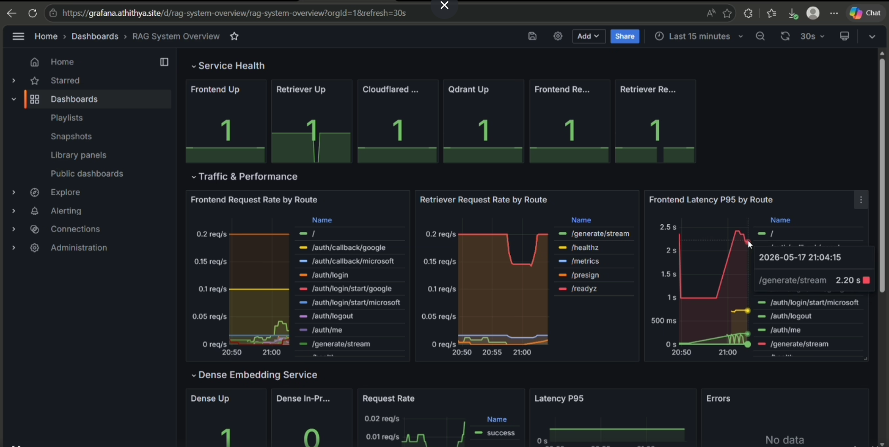

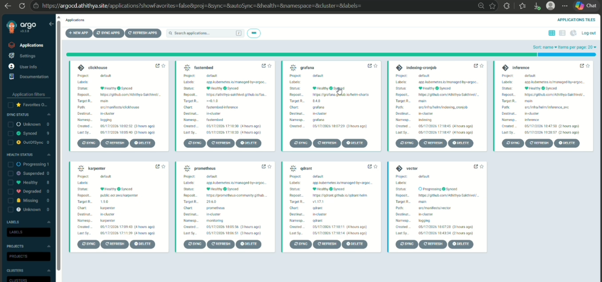

---

## Optional — Test Alerting and Disaster Recovery

Simulate a complete Qdrant outage to verify Slack alerts fire and data can be restored from S3 backups.

```sh
# 1. Pause ArgoCD sync to prevent auto-healing during the test
kubectl patch application qdrant -n argocd --type='merge' \
  -p '{"spec": {"syncPolicy": null}}'

# 2. Delete Qdrant and its persistent volumes
kubectl delete pvc -n qdrant --all --ignore-not-found=true
kubectl delete namespace qdrant --ignore-not-found=true

# 3. Wait for the QdrantDown alert to trigger (~3 minutes)
echo "Waiting for QdrantDown alert..."
sleep 180

# 4. Re-enable ArgoCD — it recreates Qdrant with fresh volumes
kubectl patch application qdrant -n argocd --type='merge' \
  -p '{"spec": {"syncPolicy": {"automated": {"prune": true, "selfHeal": true}}}}'
echo "Waiting for ArgoCD to recreate Qdrant..."
sleep 180

# 5. Confirm Qdrant is back but empty
kubectl port-forward -n qdrant svc/qdrant 6333:6333 &>/dev/null & sleep 3
echo "Points before restore:"
curl -s http://localhost:6333/collections/default_rag_collection1 | jq '.result.points_count // 0'
kill %1 2>/dev/null || true

# 6. Restore from the latest S3 backup
export DATA_S3_BUCKET=$DATA_S3_BUCKET
export QDRANT_BACKUP_S3_PREFIX="qdrant/backups/"
bash src/scripts/backups_and_restore.sh restore

# 7. Verify data recovery
sleep 10
kubectl port-forward -n qdrant svc/qdrant 6333:6333 &>/dev/null & sleep 3
echo "Points after restore:"
curl -s http://localhost:6333/collections/default_rag_collection1 | jq '.result.points_count // 0'
kill %1 2>/dev/null || true
```

**What this validates:**

- Alertmanager fires `QdrantDown` and notifies Slack
- ArgoCD self-heals infrastructure when re-enabled
- S3 backups are restorable with point-count parity

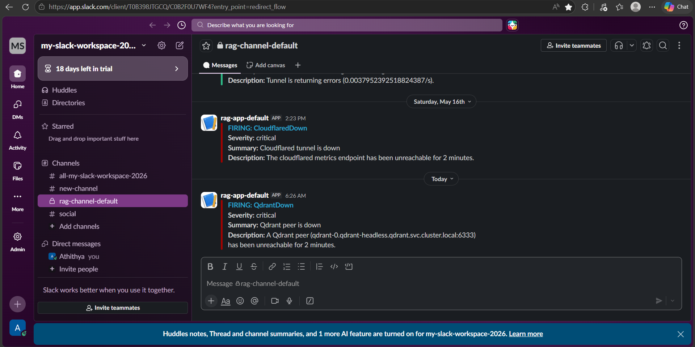

---

## Cleanup

To tear down the entire infrastructure and avoid ongoing costs:

> **Note:** Karpenter manages AWS resources (EC2 instances, VPC tags) outside Terraform state. If `terraform destroy` hangs, manually delete the VPC and verify no orphaned EC2 instances remain.

```sh
# 1. Remove workloads to trigger Karpenter scale-down
kubectl delete ns inference --ignore-not-found
kubectl delete ns fastembed --ignore-not-found
sleep 600 

# 2. Destroy Cloudflare resources
bash src/infra/terraform/cloudflare/run.sh --destroy

# 3. Destroy AWS infrastructure
bash src/infra/terraform/aws/run.sh --destroy --env staging --yes-delete
```

**Post-cleanup verification:**

- Confirm no RAG8s-specific EC2 instances remain in the `TF_VAR_region`
- Verify the EKS cluster and associated security groups are removed
- Run `python3 src/scripts/eks/force_delete.py` as a last resort for orphaned resources

---
